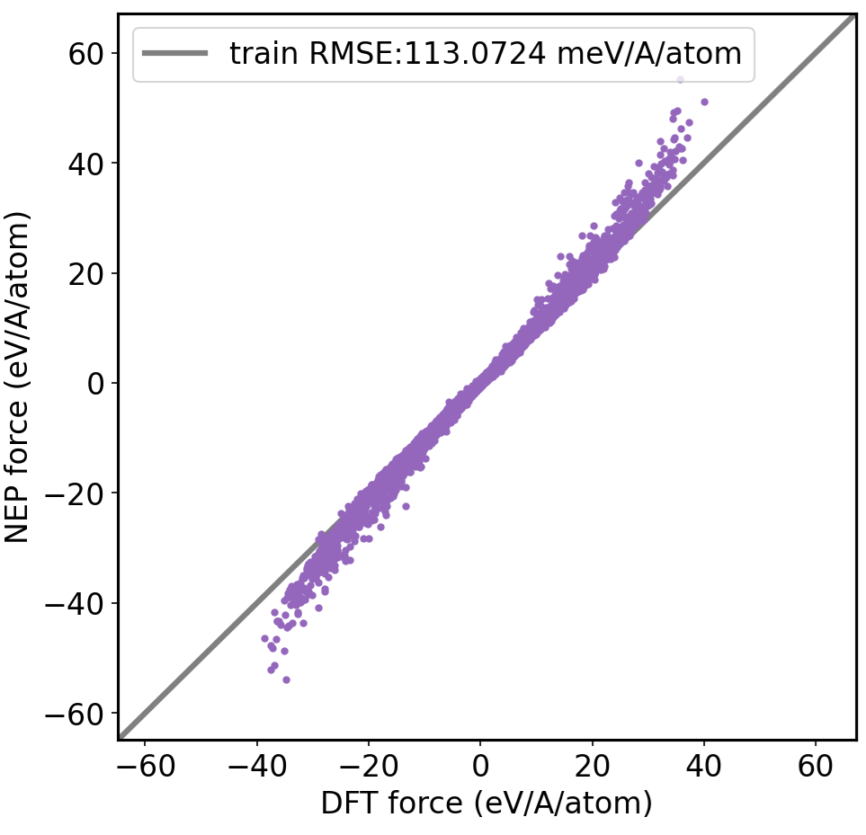
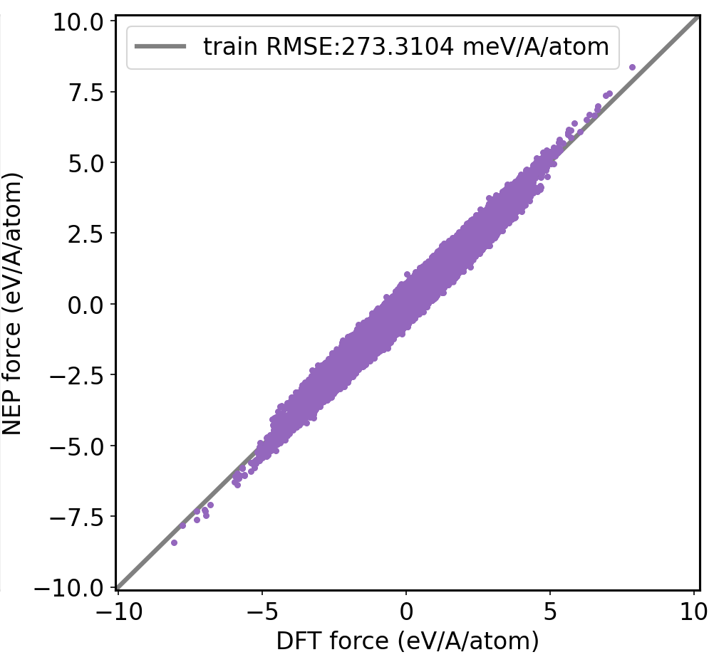

# Compare the performance of MB-pol and SCAN training sets in `NEP-water`

The training sets given by SCAN and MB-pol for NEP training will be provided here to obtain two potential functions of NEP-MB-pol and NEP-SCAN. To compare some characteristics and performance of NEP potential function in water system.

## Datasets

The datasets can be obtained separately from the following links: [MB-pol](https://doi.org/10.5281/zenodo.7577034) (J. Chem. Phys. 158, 084111 (2023)) [SCAN](https://www.aissquare.com/datasets/detail?pageType=datasets&name=H2O-Phase-Diagram&id=1) (Phys. Rev. Lett. 126, 236001 – 2021).

## Obtaining the first generation NEP-water potential function

The nep input nep.in:
```
version       4
type          2 O H
cutoff        6 4
n_max         9 7
l_max         4 2
basis_size    12 8
neuron        60
lambda_e      1
lambda_f      1
lambda_v      0
population    50
generation    500000
```

For MB-pol and SCAN, batch 2000 and batch 1000 are used respectively. This is an approximation based on 5% of the training set.

## The farthest point sampling (FPS) method and the points of the outline form a concise version of the training set.

### The second generation streamlined training set of NEP-MB-pol

Due to the diversity of the MB-pol training set, the classification method is used here when performing far-point sampling. At the same time, control the minimum number of training sets and the minimum distance of laten space.
```
for i in dimers dlpoly dplessacc dpunstable monomers tetramers trimers vle ; do
    nframe=$(grep energy ${i}.xyz |  wc -l)
    echo ${i} ${nframe}
    nframe=$(echo "${nframe} / 200" | bc)
    python nep_fps_select_all.py 24 ${i}.xyz 0.02 ${nframe} ${i}-0.02-${nframe}
done
cat selected-dimers-0.02-164.xyz selected-dlpoly-0.02-240.xyz selected-dplessacc-0.02-14.xyz selected-dpunstable-0.02-180.xyz selected-monomers-0.02-39.xyz selected-tetramers-0.02-320.xyz selected-trimers-0.02-67.xyz selected-vle-0.02-19.xyz > train.xyz
```

Based on the train.xyz (MB-pol of Full training set) and NEP-MB-pol-1, we can get the outline structure from the following command:
```
python get_outline.py $/01-MB-pol/train.xyz $/01-MB-pol/force_train.out 200 mb-pol-force
python get_outline.py $/01-MB-pol/train.xyz $/01-MB-pol/energy_train.out 68 mb-pol-energy
cat train-fps-equal.xyz findout-mb-pol-energy.xyz findout-mb-pol-force.xyz > train.xyz
nep
python plot_nep_def.py 3
```

| Datasets | fps_mindis | Number |
| --- | --- | --- |
| dimers     | 0.02 | 164 |
| dlpoly     | 0.02 | 240 |
| dplessacc  | 0.02 | 14  |
| dpunstable | 0.02 | 180 |
| monomers   | 0.02 | 39  |
| tetramers  | 0.02 | 320 |
| trimers    | 0.02 | 67  |
| vle        | 0.02 | 19  |
| findout-force  |  | 139 |
| findout-energy |  | 68  |

**Total: 1250**

### The second generation streamlined training set of NEP-SCAN

```
python nep_fps_select_all.py 24 0.02 SCAN-0.02
```

Based on the train.xyz (SCAN of Full training set) and NEP-SCAN-1, we can get the outline structure from the following command:
```
# echo "prediction 1" >> nep.in
python get_outline.py ../../01-All/02-SCAN/train.xyz ../../01-All/02-SCAN/force_train.out 200 scan-force
python get_outline.py ../../01-All/02-SCAN/train.xyz ../../01-All/02-SCAN/energy_train.out 80 scan-energy
cat selected-SCAN-0.02.xyz findout-scan-force.xyz findout-scan-energy.xyz > train.xyz
nep
python plot_nep_def.py 3
```

| Datasets | fps_mindis | Number |
| --- | --- | --- |
| fps     | 0.02 | 358 |
| findout-force  |  | 163 |
| findout-energy |  | 80  |

**Total: 601**

### NEP-SCAN to prediction the other SCAN datasets.

[1] [H2O-SCAN0](https://www.aissquare.com/datasets/detail?pageType=datasets&name=H2O-SCAN0&id=18)



[2] [H2O-DPLR](https://www.aissquare.com/datasets/detail?pageType=datasets&name=H2O-DPLR&id=17)


